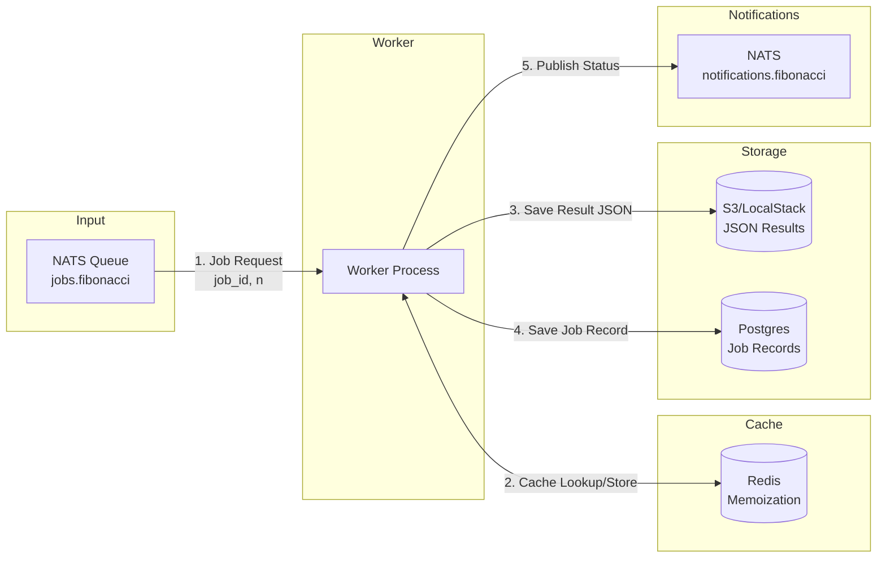

# Testcontainers Demo

## Table of Contents

- [Overview](#overview)
  - [Data Flow](#data-flow)
  - [Message Formats](#message-formats)
- [Usage](#usage)
  - [Prerequisites](#prerequisites)
  - [Setup](#setup)
  - [Running Tests](#running-tests)
  - [Local Development with Docker Compose](#local-development-with-docker-compose)
  - [Manual Testing](#manual-testing)
  - [Verifying Results](#verifying-results)
- [Testcontainers](#testcontainers)
  - [Key Benefits](#key-benefits)
  - [Architecture](#architecture)
  - [Installation](#installation)
  - [Popular Python Modules](#popular-python-modules)
  - [Examples](#examples)
  - [Advanced Configuration](#advanced-configuration)
  - [Resources](#resources)

## Overview

A queue worker that computes Fibonacci numbers, demonstrating testcontainers with Python. The worker subscribes to a NATS queue, computes Fibonacci numbers using Redis for memoization, stores results in S3, and persists job metadata to Postgres.

### Data Flow



### Message Formats

**Job Input** (`jobs.fibonacci`):
```json
{"job_id": "uuid", "n": 50}
```

**Notifications** (`notifications.fibonacci`):
```json
{"job_id": "uuid", "status": "started|progress|completed", "timestamp": "..."}
```

## Usage

### Prerequisites

- Python 3.11+
- Docker (for testcontainers and local development)
- [uv](https://docs.astral.sh/uv/) package manager (recommended)

### Setup

```bash
# Install dependencies
uv sync --all-extras

# Or with pip
pip install -e ".[dev]"
```

### Running Tests

```bash
# Run all tests
uv run pytest tests/ -v

# Run unit tests only
uv run pytest tests/test_unit.py -v

# Run integration tests only
uv run pytest tests/test_integration.py -v
```

Tests use testcontainers to automatically spin up Postgres, Redis, NATS, and LocalStack containers.

### Local Development with Docker Compose

```bash
# Start all services
docker compose up -d

# View logs
docker compose logs -f worker

# Stop services
docker compose down
```

### Manual Testing

With docker compose running, you can manually submit jobs and observe the worker:

```bash
# Install NATS CLI (if not already installed)
# macOS: brew install nats-io/nats-tools/nats
# Linux: go install github.com/nats-io/natscli/nats@latest

# Subscribe to notifications (in one terminal)
nats sub "notifications.fibonacci"

# Submit a job (in another terminal)
nats pub jobs.fibonacci '{"job_id": "test-001", "n": 20}'

# Submit a larger job with progress updates
nats pub jobs.fibonacci '{"job_id": "test-002", "n": 150}'
```

Alternatively, use Python to submit jobs:

```python
import asyncio
import json
import uuid
import nats

async def submit_job(n: int):
    nc = await nats.connect("nats://localhost:4222")

    # Subscribe to notifications
    async def handler(msg):
        print(f"Notification: {msg.data.decode()}")

    await nc.subscribe("notifications.fibonacci", cb=handler)

    # Submit job
    job = {"job_id": str(uuid.uuid4()), "n": n}
    await nc.publish("jobs.fibonacci", json.dumps(job).encode())
    print(f"Submitted: {job}")

    await asyncio.sleep(2)  # Wait for notifications
    await nc.close()

asyncio.run(submit_job(30))
```

### Verifying Results

Check the database for completed jobs:

```bash
docker compose exec postgres psql -U postgres -c "SELECT * FROM jobs;"
```

Check S3 for result files:

```bash
# List objects in the bucket
aws --endpoint-url=http://localhost:4566 s3 ls s3://fibonacci-results/results/

# View a result file
aws --endpoint-url=http://localhost:4566 s3 cp s3://fibonacci-results/results/<job-id>.json -
```

## Testcontainers

Testcontainers is an open-source library that provides lightweight, throwaway Docker containers for integration testing. Instead of mocks or in-memory substitutes, you test against real services—databases, message brokers, browsers—with automatic lifecycle management. Rated **Adopt** on the [Thoughtworks Technology Radar](https://www.thoughtworks.com/radar/languages-and-frameworks/testcontainers), it's recognized as an industry best practice for reliable test environments.

### Key Benefits

| Benefit | Description |
|---------|-------------|
| **On-demand isolation** | No pre-provisioned infrastructure needed. Each pipeline gets isolated containers—no test data pollution |
| **Local = CI parity** | Run integration tests from your IDE just like unit tests. Same behaviour locally and in CI |
| **Reliable startup** | Built-in wait strategies (log, HTTP, port, health check) ensure containers are ready before tests run |
| **Automatic cleanup** | Ryuk sidecar removes all resources after tests—even after crashes or SIGKILL |
| **Dynamic port mapping** | Container ports map to random available host ports for reliable connections |

### Architecture

Testcontainers uses a layered design:

- **`DockerContainer`** (GenericContainer): Start any Docker image, expose ports, configure wait strategies, access metadata
- **Specialized modules** (e.g., `PostgresContainer`): Pre-configured containers with helper methods like `get_connection_url()`

This balances flexibility (any Docker image) with convenience (zero-config for common services).

### Installation

```bash
pip install testcontainers[postgres]
```

Database drivers are not bundled—install them separately (e.g., `psycopg`, `sqlalchemy`).

**Requirements:** Python 3.8+ and a Docker-compatible runtime (Docker Desktop, Docker Engine, or Testcontainers Cloud).

### Popular Python Modules

| Category | Modules |
|----------|---------|
| **Databases** | PostgreSQL, MySQL, MongoDB, Redis, Elasticsearch |
| **Message Brokers** | Kafka, RabbitMQ, NATS |
| **Cloud** | LocalStack (AWS), MinIO |
| **Web/Testing** | Selenium, Nginx |

See the [full module list](https://testcontainers.com/modules/?language=python) for 40+ available services.

### Examples

#### Database Integration Test

```python
from testcontainers.postgres import PostgresContainer
import psycopg

with PostgresContainer("postgres:16-alpine") as postgres:
    with psycopg.connect(postgres.get_connection_url(driver=None)) as conn:
        with conn.cursor() as cur:
            cur.execute("CREATE TABLE users (id SERIAL PRIMARY KEY, name VARCHAR(100))")
            cur.execute("INSERT INTO users (name) VALUES ('Alice')")
            cur.execute("SELECT * FROM users")
            assert len(cur.fetchall()) == 1
```

#### Pytest Fixture with Lifecycle Management

```python
import pytest
import os
from testcontainers.postgres import PostgresContainer

postgres = PostgresContainer("postgres:16-alpine")

@pytest.fixture(scope="module", autouse=True)
def setup(request):
    postgres.start()
    os.environ["DB_CONN"] = postgres.get_connection_url(driver=None)
    request.addfinalizer(postgres.stop)

def test_create_user():
    # Test runs against real PostgreSQL
    pass
```

#### Generic Container for Any Service

```python
from testcontainers.core.container import DockerContainer
from testcontainers.core.waiting_utils import wait_for_logs

with DockerContainer("redis:7-alpine").with_exposed_ports(6379) as redis:
    wait_for_logs(redis, "Ready to accept connections")
    host, port = redis.get_container_host_ip(), redis.get_exposed_port(6379)
```

### Advanced Configuration

#### Environment Variables

| Variable | Description | Default |
|----------|-------------|---------|
| `TESTCONTAINERS_DOCKER_SOCKET_OVERRIDE` | Docker socket path | `/var/run/docker.sock` |
| `TESTCONTAINERS_HOST_OVERRIDE` | Container IP override | Auto-detected |
| `TESTCONTAINERS_RYUK_DISABLED` | Disable cleanup container | `false` |
| `TESTCONTAINERS_RYUK_PRIVILEGED` | Run Ryuk privileged | `false` |
| `RYUK_CONTAINER_IMAGE` | Custom Ryuk image | `testcontainers/ryuk:0.8.1` |
| `DOCKER_AUTH_CONFIG` | Private registry credentials (JSON) | — |

#### Private Registry Authentication

```bash
# AWS ECR
export DOCKER_AUTH_CONFIG='{"credHelpers": {"<account>.dkr.ecr.<region>.amazonaws.com": "ecr-login"}}'

# Inline credentials
export DOCKER_AUTH_CONFIG='{"auths": {"registry.example.com": {"auth": "<base64>"}}}'
```

#### Connection URLs

Database containers provide `get_connection_url()` with optional driver specification:

```python
postgres.get_connection_url()              # postgresql+psycopg2://...
postgres.get_connection_url(driver=None)   # postgresql://... (for psycopg v3)
```

### Resources

- [Official Site](https://testcontainers.com/)
- [Python Documentation](https://testcontainers-python.readthedocs.io/)
- [Getting Started Guide](https://testcontainers.com/guides/getting-started-with-testcontainers-for-python/)
- [Available Modules](https://testcontainers.com/modules/?language=python)
- [Thoughtworks Technology Radar](https://www.thoughtworks.com/radar/languages-and-frameworks/testcontainers)
